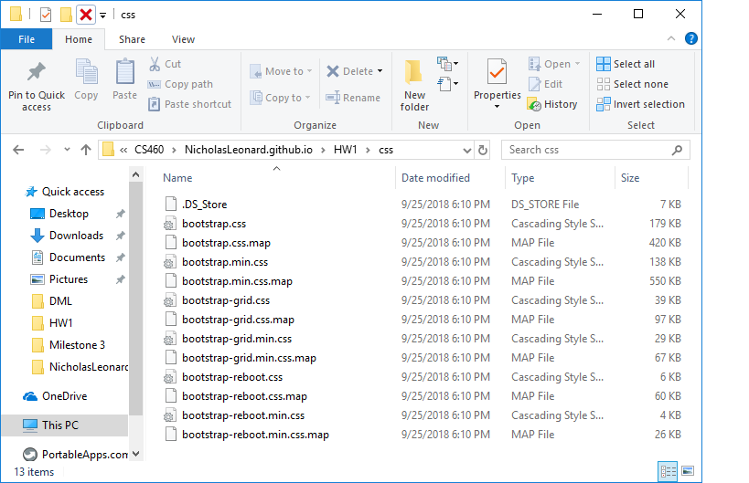

# Nicholas Leonard

## Homework 1

I have never used any of these programs before, so this whole project was a new experience for me. I really enjoyed it and I enjoyed learning new tools as well as experimenting with them to cement the processes in my head and so I can understand how they work.

### Important Links!

Here is the link to my main GitHub repository, which holds all of my source code for this assignment.<br/>
[GitHub Repository](https://github.com/NicholasLeonard/NicholasLeonard.github.io)

Here is the link to the website I made for this assignment.<br/>
[Demo](wk1Website.html)

This link will take you back to my main Portfolio page.<br/>
[Portfolio](../../index.md)

<br/>

### Step 1. Setting up git and making a GitHub account and repository.

The first thing I had to do was actually download git from the provided link in the homework page. Once I had downloaded and installed git and created the remote repository on GitHub, I had to clone the repository onto my local machine.

```bash
git clone https://github.com/NicholasLeonard/NicholasLeonard.github.io.git
```

After I made the clone, I had to run two git config commands to properly set my git username and email to match with my GitHub profile.

```bash
git config --global user.name "Nicholas Leonard"
git config --global user.email nleonard17@wou.edu
```

After that, I did an initial commit with the first page of my website.

```bash
git add wk1Website.html

commit 5a36acf9ae9cf36f35dbe4e9cdb4ddbc4c1d63cd
Author: Nicholas Leonard <nleonard17@wou.edu>
Date:   Tue Sep 25 12:32:34 2018 -0700

    First stages of html page for website 1
```

<br/>

### Step 2. Coding a Multipage Website using HTML and Bootstrap.

For this assignment, I had to make a website with multiple pages. The overall style and formatting of the pages was up to me, but my site had to contain at least two different kinds of lists, a table, and demonstrate the use of single column and multicolumn layouts. I decided to have a single column for my home page where I detailed what the website was about and then I used multiple columns in later pages.

```html
<div class="container pushdown">
        <h1>My First Experience</h1>
        <div class="row">
            <div class="col">
                <p> Welcome to my first ever webpage! It has been a long time coming but 
                    here it finally is. As is fitting, this webpage will hold some of my 
                    first ever stuff. Have fun clicking through and learning a little about
                    me.</p>
            </div>
        </div>
    </div>
```
I wanted the text to appear in a box on top of the regular background so I put it into a container to allow for more specific customization options. I also had to use bootstrap 4 for the general formatting of the pages. I was, however, not allowed to use absolute links for this assignment so I downloaded the bootstrap 4 zip from the link provided in the homework details page (linked [here](http://www.wou.edu/~morses/classes/cs46x/assignments/HW1.html)) and put the files in my local repository.



To get Bootstrap to work with my pages, I had to include the necessary links in the head element of my HTML document. I also had to create and use my own CSS file, which I also linked in the head of the document.

```html
<head>
    <meta charset="utf-8" />
    <meta http-equiv="X-UA-Compatible" content="IE=edge">
    <title>First Official Webpage</title>
    <!--Necessary BootStrap 4 links-->
    <link rel="stylesheet" type="text/css" href="css/bootstrap.min.css">
    <meta name="viewport" content="width=device-width, initial-scale=1">
    <!--My CSS code link-->
    <link rel="stylesheet" type="text/css" href="style.css" />
    <script src="main.js"></script>
</head>
```

One of the assignment requirements, was to include some form of link navigation so that all pages in my website could be accessed. I decided to use an active tab system because I thought it looked cool and it also allowed me to use one of the two lists I needed to meet the requirements. Therefore, I included the HTML coding for a navbar and active tab system to provide navigation functionality. I repeated this code on subsequent pages so that they were all linked together.

```html
<nav class="navbar">
        <ul class="nav nav-tabs">
            <li class="nav-item">
                <a class="nav-link active" href="wk1Website.html">Home</a>
            </li>

            <li class="nav-item">
                <a class="nav-link" href="wk1Websitepg1.html">Pictures</a>
            </li>

            <li class="nav-item">
                <a class="nav-link" href="wk1Websitepg2.html">About</a>
            </li>
        </ul>
    </nav>
```

Making the navigation bar and link system was a lot of fun. I started with dummy links and titles because I did not yet have additional pages to link to and I did not know what to call the other pages. However, once I got going, it started to come pretty easily and I was able to come up with some names for my different pages. I did, however, almost forget to go back and change the names of the links on all the pages. I even forgot to add the active class to the current page I was on so that the tab would highlight. It all worked out in the end though.

For the next page, I decided to use two columns of images with descriptive text to knockout the multicolumn requirement, but to also provide some practice with image linking. So I used bootstrap div, container, row, and column classes to position the images on the page and then created links to include the images. I did some specific modifications in my CSS file for these elements that I will talk about a little bit later.

```html
 <div class="container pushdown">
         <div class="row">
             <div class="col-sm-6">
                 <div class="contanier">
                     
                     <p class="pushdown" id="caption">Here is a picture of my first car. Manual transmission for life!</p>
                    </div>
             </div>
             <div class="col-sm-6">
                 <div class="container">
                     
                     <p class="pushdown" id="caption">This is a picture of my first GPU that I got when building my computer.</p>
                 </div>
                 
             </div>
         </div>

         
     </div>
```

Once I finished the picture page, I moved on to the third and final page of the website where I decided to use a detail list and a table of first events to finish off the remaining HTML requirements. I decided to use a detail list element because I wanted to list some of the things I like to do and then provide a little description about them. This list turned into more of a get to know me rather than first events, but I enjoyed making it all the same. The table on the same page, however, does include entries about first events, which kept more in line with the theme of the website.

For this page, I decided to put the list and the table into two columns to keep with the multicolumn requirement, but I used some of bootstraps cool column features to do it. I had the columns span different widths of the page so that the table had more horizontal room than the list. After finishing the list, I put in a table to finish the requirement. The table contained several entries that detailed some of my first events such as camping. The syntax for the table was a little confusing for me and it was hard to keep it straight, but I managed to tackle this too.


```html
<div class="container">
        <div class="row">
            <div class="col-sm-5">
                <dl>
                    <dt>Video Games</dt>
                    <dd>I like playing all kinds of games from retro mario to modern shooters.</dd>
                    
                    <dt>Camping</dt>
                    <dd>I love all kinds of camping. I have camped by a lake where I've gone fishing and
                        I have also camped out in a lodge with the fire roaring and snow outside.
                    </dd>

                    <dt>Driving</dt>
                    <dd>I love driving on a sunny day with the windows down and the radio up. Part of
                        the reason I like to drive I think is that I drive a manual transmission. It
                        is a lot of fun.
                    </dd>

                    <dt>Being with friends and family</dt>
                    <dd>My family and friends are two of the most important things in my life. I love to sit and talk with them or watch movies with them or just hangout and chill.</dd>

                    <dt>Watching Movies</dt>
                    <dd>I love all kinds of movies. From old westerns and war movies to modern movies like Avatar and Avengers Infinity War. I especially enjoy watching them with other people.</dd>
                </dl>
            </div>
```
```html
<div class="col-sm-7">
                <div class="table-responsive-sm">
                    <table class="table table-bordered">
                        <tr><th>First Event</th> <th>Where</th></tr>
                        <tr><td>Camping trip</td> <td>A lake somewhere</td></tr>
                        <tr><td>Job</td> <td>Baldwin - Boy Scout Summer Camp</td></tr>
                        <tr><td>Word</td> <td>Ball</td></tr>
                        <tr><td>Video Game</td> <td>Spyro: Rypto's Rage</td></tr>
                    </table>
                </div>
            </div>
```
</br>

### Step 3 Styling the website using CSS

For this homework assignment, I had to use a CSS file to consistently style my website. Therefore, I specifically styled paragraph and header elements black because I wanted consistent black text throughout. I was also able to set the standard background of the pages to a muted grey and change the color of the container class to a white-like color so that it would stand out nicely from the background. I also defined a new class, pushdown, which I used for the container and image elements to position them on the pages. I also created an id for specific <code><p></code> elements so that I could use them as captions with my images. This allowed me to mess with justification and alignment for the captions of the images.

```css
body {
    background-color: rgb(82, 79, 79);    
}

/*Changes the color of the container class.*/
.container{
    background-color: aliceblue;
}

h1 {
    color: black;
}

h2 {
    color: black;
}

p {
    color: black;    
}

/*Provides margins for some of my pages.*/
.pushdown{
    margin-top: 20px;
}

/*ID for caption text for pictures*/
#caption{
    text-align: center
}

/*Alignment modification for pictures on website*/
.img{
    vertical-align: middle
}
```

That is how I made my website. I would like to continue to tweak and experiment with elements to improve the website as well as my skill. However, for now, this is how it will stay. If you want to preview my website, follow the link marked Demo at the top of this page. Thanks for reading!
