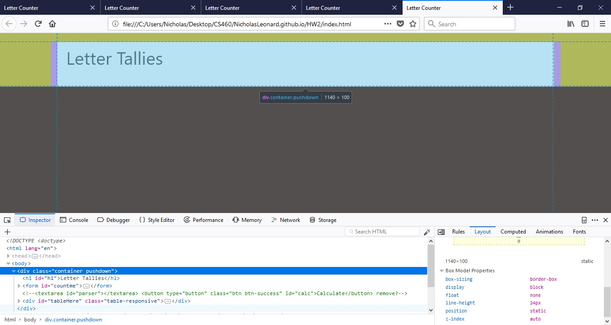
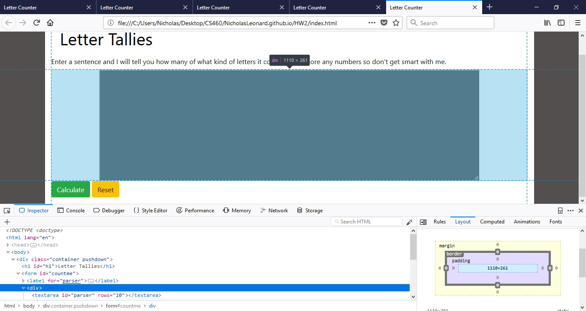
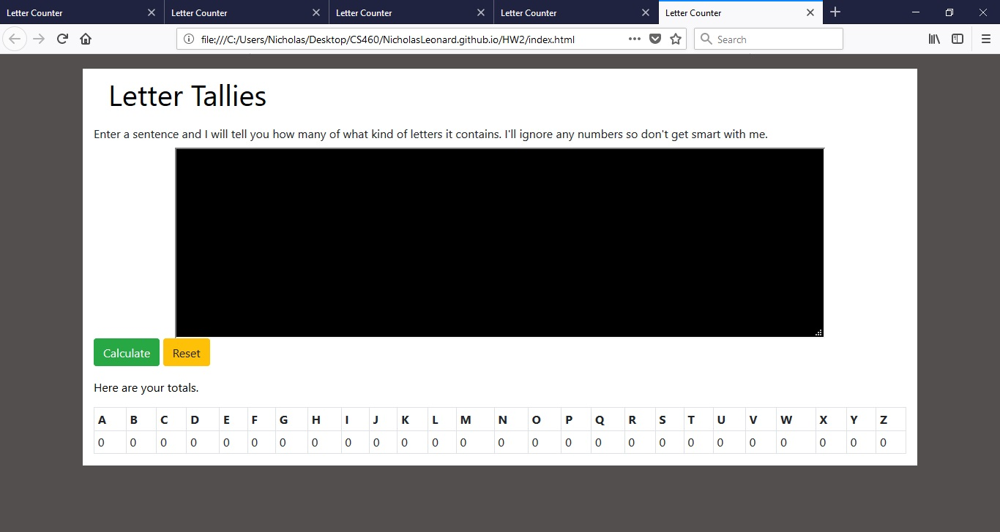

# Nicholas Leonard
<br/>
## Homework 2

Once again, I have never used javaScript or jQuery before but I found the process fun and fairly straight forward. For this assignment, I had to make another webpage and then use javascript and jquery to modify it in some way. Therefore, I decided to do a letter counter that would take an input string from the user and then return a jquery generated table with the total counts of each letter used. I had a lot of fun doing it and it turned out pretty well. I also had to use a seperate branch in git to do this "feature" and then merge it back into the main branch when I was finished. That was cool because I got some experience with branching and work flow control in git.

### Important Links
Here is the link to my github repository that holds all the source code for this assignment.<br/>
[Github Repository](https://github.com/NicholasLeonard/NicholasLeonard.github.io)

This is the link to the page that I made for this assignment. Please, give it a try.<br/>
[Letter Counter](index.html)

This link will take you back to my home Portfolio page.<br/>
[Home](../index.md)

<br/>
### Step 1. Creating a new feature branch in git for Hwk2.

The first thing I had to do, was create a new branch to work on so I could git (hehe) some experience with branching. So using the git branching command, I created a new branch and checked it out so that I all the work for this assignment would be on the assignment branch instead of master.
```bash
git branch hw2

git checkout hw2
```

<br/>
### Step 2-3. Planning and Design

After I created the new working branch and checked it out, I had to decide what exactly I wanted to do and whether or not to add it to my original website. I decided not to add it to the website I made for assignment 1 because I wanted to keep each assignment isolated so that they could be viewed individually. I did, however, decide to use most of the styling in my CSS file from the original website.

Once I decided that I was not going to add it to the first website, I had to decide what I was going to do. The requirement stated that I had to read input from the user and then display something and modify my page in some way. I had to use javascript and jquery to modify existing elements, and add new elements to the page. I decided to create a simple tallier that would read an input string from the user and then generate a table that showed the total number of each letter that was used in the string.

I also had to consider how I wanted to design the site. I decided to have one main container with a form that contained the input area and have the table in a new `<div>` element beneath it.


After I had the initial container, I would use a header tag to display a title for the following elements.



Then I wanted to add the form with a text area input type to allow the user to enter an input string of any length as appossed to the 20 or so limit with a standared input form element. I also wanted to add a caption to the form with an instructional message to the user.


Furthermore, I wanted to add two buttons to the form for submitting the form to begin the calculation and for resetting the form to allow the user to enter a new input string. I also wanted to style these buttons using Bootstrap 4 to make them a little more interesting.



I had originally thought to have the input box in a left column and generate the table in a right column, but I decided it would be better to utilize a vertical alignment. Thus, I decided to have the input area at the top of the page and have the table appear beneath it. I also wanted to highlight the letters that the user actually used so I wanted to use Bootstrap 4 to add some table highlights.


<br/>
### Step 4. Coding the page in HTML, styling with CSS, and using JavaScript and JQuery to modify

After I finished designing the page and coming up with ideas, it was time to begin coding. I started with the main container, the title header, and the input form. As I stated earlier, I wanted a `textarea` input element because it allows for longer inputs then the standared input element. I used CSS to style the input area extensively and I will talk about that later. I did, however, have to specify the number of rows for the text area in the tag. I also added two Bootstrap 4 form buttons for submitting the form to begin the calculation as well as a reset button to reset the form and clear any previously generated tables.

```html
<body>
    <div class="container pushdown">
            <h1 id="h1">Letter Tallies</h1>
                <form id="countme">
                    <label for="parser">Enter a sentence and I will tell you how many of what kind of letters it contains. I'll ignore any numbers so don't get smart with me.</label>
                    <div>
                        <textarea rows="10" id="parser"></textarea>
                    </div>
                    <button type="submit" class="btn btn-success" id="calc">Calculate</button>
                    <button type="reset" class="btn btn-warning" id="reset">Reset</button>
                </form>
```

After I made the initial form, I had to create a new `<div>` element to put the generated table in. I kept it in the same container as the form so that it would just expand down the page as the table was made. I had to give the element an id so that I could reference it in my javascript and jquery later on.
```html
<div class="container pushdown">
            <h1 id="h1">Letter Tallies</h1>
                <form id="countme">
                    <label for="parser">Enter a sentence and I will tell you how many of what kind of letters it contains. I'll ignore any numbers so don't get smart with me.</label>
                    <div>
                        <textarea rows="10" id="parser"></textarea>
                    </div>
                    <button type="submit" class="btn btn-success" id="calc">Calculate</button>
                    <button type="reset" class="btn btn-warning" id="reset">Reset</button>
                </form>
               
                <div class="table-responsive" id="tableHere">

                </div>
        </div>
        
    </div>
```

I also had to make sure that the `<body>` element had the scripts to jquery and my javascript files so that the page could be modified. I decided to use a CDN to load the jquery rather than hosting it my self.

```html
<script src="https://ajax.googleapis.com/ajax/libs/jquery/3.3.1/jquery.min.js"></script>
  <script src="index.js"></script>
</body>
```
I used a CSS file to style my page. The main stylings I copied over from the file I used for my previous webpage, however, I added several other stylings for specific elements on this page. I used the CSS mainly to style the input text area to look like a DOS command shell, which I thought was pretty cool. I also used the CSS to position the input area in the middle of the page and to mess with its size. I added some padding to other elements and specifically created one class to use with my table so that I could highlight specific cells.

```css
/*Styling for wk2webpage*/

/*id for one trick header*/
#h1{
    color: black;
    padding: 10px;
    text-indent: 10px;
}


.container{
    background-color: white;    
}

/*Additional padding for the container div holding the parser form*/
#parscontainer{
    padding-bottom: 40px;
}

/*styles the input textarea*/
#parser{
    margin: 0 auto;
    display: block;
    width: 80%;
    background-color: black;
    color: white;
}

/*highlighting cells that have letters in result table*/
.have{
    background-color: green;
    color: black
}
```

### JavaScript and JQuery

Once I had coded the page and styled it, I had to write my javascript and JQuery to modify the page. I used jQuery primarily for actions and javascript for functions. I started by waiting for an event on the submit button of the form. However, when I was testing the site it would generate a table each time but not clear the one from before, so I had to add a jQuery event, which cleared the table.

```javascript
$(document).ready(function(){
    $("#countme").submit(clr_tble);
    $("#countme").submit(getString); //start calculation once the form is submitted.
    $("#reset").click(clr_tble); //this is to clear the table from a previous entry or a reset.
});
```

As you can see from the snippet above, jQuery identifies the form element by its id and then listens for the event, which in this case, is the submission of the form. Once the form has been submitted, it begins by calling getString, which is a javascript function I wrote to handle the input and calculation. 

```javascript
//used to get the data from the text area for parsing and counting. Returns false so form works.
function getString(){
        var content = $.trim($("#parser").val());
        console.log(content);//test string input
        count(content);//used to total letters
        return false;//prevents form from automatically submitting and resetting
    }
```
This function uses jquery to get the input from the form and put it into a content variable, which is then passed to a count function that does the hard computation. I also included several `console.log()` commands to display the steps of the function to the browser console so I could confirm that the data was actually being passed. I had a problem where when the form was submitted, it would cycle through everything and then wipe everything out. To solve this problem, I had to have this function return false. This prevented the page from continousley cycling.

Once `getString()` retrieved the users input, I passed it to `count()` to do the computation. Once again, I used several `console.log()` commands to record the process of the data through the function.

```javascript
//used to prep for calculation
function count(content){
    //converts string to lowercase characters for comparison
    var content = content.toLocaleLowerCase();
    console.log(content + " lower_case_str");//used for testing

    //gets the length of the string for loop
    length = content.length;
    console.log(length + " length_of_string")//used for testing

    //array to hold totals of letter counts
    var tallies = [];
    for(i=0; i<26; i++){
        tallies.push(0);
    }
    
    console.log(tallies.length + " num_of_elements");//testing lenght of tallies
    console.log(content.charAt(0) + " first_letter");//testing that content.charAt() was working

    // loop provides work for tallying letters
    for(i = 0; i < length; i++){
        console.log("test_for_loop");//making sure loop is working
        var char = content.charAt(i); //used to get individual letters from input string for comparison
        console.log(char + " test_of_char"); //confirming that char is getting letters

        switch (char){ //used to provide 26 comparisons for english letters
            default:    //this way nonletter characters are skipped.
                break;               
            case "a"://add comment to webpage for empty tally array
                tallies[0] = tallies[0] + 1;
                break;
            case "b":
                tallies[1] = tallies[1] + 1;
                break;
            case "c":
                tallies[2] = tallies[2] + 1;
                break;
            case "d":
                tallies[3] = tallies[3] + 1;
                break;
            case "e":
                tallies[4] = tallies[4] + 1;
                break;
            case "f":
                tallies[5] = tallies[5] + 1;
                break;
            case "g":
                tallies[6] = tallies[6] + 1;
                break;
            case "h":
                tallies[7] = tallies[7] + 1;
                break;
            case "i":
                tallies[8] = tallies[8] + 1;
                break;
            case "j":
                tallies[9] = tallies[9] + 1;
                break;
            case "k":
                tallies[10] = tallies[10] + 1;
                break;
            case "l":
                tallies[11] = tallies[11] + 1;
                break;
            case "m":
                tallies[12] = tallies[12] + 1;
                break;
            case "n":
                tallies[13] = tallies[13] + 1;
                break;
            case "o":
                tallies[14] = tallies[14] + 1;
                break;
            case "p":
                tallies[15] = tallies[15] + 1;
                break;
            case "q":
                tallies[16] = tallies[16] + 1;
                break;
            case "r":
                tallies[17] = tallies[17] + 1;
                break;
            case "s":
                tallies[18] = tallies[18] + 1;
                break;
            case "t":
                tallies[19] = tallies[19] + 1;
                break;
            case "u":
                tallies[20] = tallies[20] + 1;
                break;
            case "v":
                tallies[21] = tallies[21] + 1;
                break;
            case "w":
                tallies[22] = tallies[22] + 1;
                break;
            case "x":
                tallies[23] = tallies[23] + 1;
                break;
            case "y":
                tallies[24] = tallies[24] + 1;
                break;
            case "z":
                tallies[25] = tallies[25] + 1;
                break;                    
        }
    }
    console.log(tallies + " tallies of letters"); //confirming final tallies

    genTable(tallies);//used to make the result table
};
```

Once I had the counts for the letters, I used `genTable()` to create and populate the table. I continued to use `console.log()` to record the steps of data through the function and to confirm that everything was working properly.

```javascript
//used to generate the table with tally totals.
function genTable(tallies){

    //jquery to create initial outline of table
    $("#tableHere").append('<p>Here are your totals.</p>', '<table class="table table-bordered table-condensed" id="tallytble">');
    $("#tallytble").append("<tr id='hdrw'>");
    $("#tallytble").append("<tr id='drw'");
    
    //array containing headers for table
    var headers = ['A','B','C','D','E','F','G','H','I','J','K','L','M','N','O','P','Q','R','S','T','U','V','W','X','Y','Z'];

    console.log(headers + " headers_for_table");//testing headers for array

    //loop for populating result table
    for(i=0; i < tallies.length; i++){
        if(tallies[i]>0){
            $("#hdrw").append("<th class='have'>"+ headers[i] +"</th>");
            $("#drw").append("<td class='have'>"+ tallies[i] +"</td>");
        }else{
            $("#hdrw").append("<th>"+ headers[i] + "</th>");
            $("#drw").append("<td>"+tallies[i]+"</td>"); 
        }      
    }
};
```

The resulting computation was displayed in a formatted table that highlighted the inputs so the user can easily find what letters they used and how many there were.


It is however, a rather boring display when nothing is entered.



That is my Letter Tallier. I encourage you to try it out. It also utilizes classes like `table-responsive` to make the table scrollable when you shrink the screen. This contributes to the webpages ability to work and display on smaller screens, which is an important feature of responsive webdesign.

### Merging back to Master

After I finished all the work on this page, I had to merge the feature branch back with the main branch. I accomplished this by checkingout the master branch and then merging my feature branch with the master branch. You can even see the branch merge with master with the `git graph` command. Thanks for reading!

```bash
git checkout master
git merge hw2

$ git log --oneline --graph
* 1342974 (HEAD -> master, origin/master, origin/HEAD) Fixed bug in blog 2.
* 13183c1 Added to blog 2 and improved the photo.
* 07f5b3d First coupld entries in blog 2. Testing picture link.
* ae71e99 Beginnings of the blog post.
* c18352a Pics for blog 2 and cleaned up html and commented CSS.
*   1e144b8 Completeing merge of master and hw2
|\
| * 053c721 (origin/hw2, hw2) Finished webpage, CSS, and Javascript files.
| * 47f8f12 Fully functional javascript and jquery.
| * 44d207c Minor additions
| * 3e8bf3b Finished code for calculation.
| * 9f2ab3f Changes to html and javascript.
| * ea6fde3 Started formatting webpage and CSS. Created JavaScript file.
| * 48df648 Beginnings of new webpage with additional styles in CSS file.
| * 742129c Initial commit of hw2 feature work.
* | 9463b40 Modified README to show commit on master.
|/
* 15a2f3b Last formatting tweaks to blog 1.
* e67b608 Final final formatting for blog 1.
```