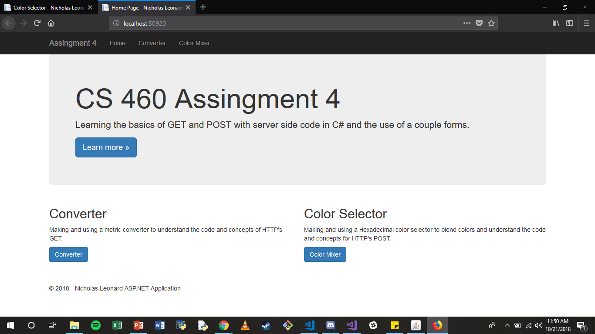

# Nicholas Leonard

## Homework 4

This assignment was all about MVC and HTTP's GET and POST methods. To complete this assignment, I had to utilize tools and languages that I have been learning throughout this entire term as well as some new ones like HTML's Razor helper functions. I really enjoyed this project. I found learning about GET and POST methods and how they work really interesting. I also thought the two tasks I had to do to demonstrate their use fun and interesting.

### Important Links

Here is the link to my GitHub repository, which houses all of the source code for this assignment and others. <br/>
[GitHub Repository](https://github.com/NicholasLeonard/NicholasLeonard.github.io)<br/>

Here is a link to a video, which demos the pages that I created for this assignment.<br/>
[Assignment 4 Demo](https://www.youtube.com/watch?v=WraBgHU4vdU)<br/>

This link will take you back to my main portfolio page.
[Home](../../index.md)

### Step 1. Creating a new MVC Project and Learning the Design Layout

Assignment 4 involved learning GET and POST by building a new Method View Controller (MVC) that had two views, one contained a metric Converter that used GET and the other had a Color Mixer using POST. The first thing I had to do was create a new MVC project in Visual Studio. After I created a new MVC .NETFRAMEWORK project, I went through the folders and files it created to learn the layout and what did what.

### Step 2. Creating the Landing Page

Once I figured out all the files and folders, I went to work constructing the actual application. Visual Studio is nice in the fact that when it created the new project, it defined a predetermined layout and style so I just modified the landing page to suit my needs. I added new descriptions and titles to the section heads and modified the effects of the buttons.

```html
@{
    ViewBag.Title = "Home Page";
}

<div class="jumbotron">
    <h1>CS 460 Assingment 4</h1>
    <p class="lead">Learning the basics of GET and POST with server side code in C# and the use of a couple forms.</p>
    <p><a href="https://www.wou.edu/~morses/classes/cs46x/assignments/HW4_1819.html" class="btn btn-primary btn-lg">Learn more &raquo;</a></p>
</div>

<div class="row">
    <div class="col-md-6">
        <h2>Converter</h2>
        <p>
            Making and using a metric converter to understand the code and concepts of HTTP's GET.
        </p>
        <p><a class="btn btn-primary" @Html.ActionLink("Converter","Converter","Home") </a></p>
    </div>
    <div class="col-md-6">
        <h2>Color Selector</h2>
        <p>Making and using a Hexadecimal color selector to blend colors and understand the code and concepts for HTTP's POST.</p>
        <p><a class="btn btn-primary" @Html.ActionLink("Color Mixer","Create","Color") </a></p>
        
    </div>
</div>
```



### Step 3. The Converter

Once the landing page was done, I moved on to the Converter page, which utilized the same controller as the landing page. On this page, I used plain old HTML to structure the page and make the form for the input. The form on this page used GET to request from the server and passed data via query strings in the URI. The form element I created called the GET Converter action method defined in the Home Controller. I used two medium columns in the form to put the mile input and error text on one side and the radio buttons for the metric unit conversion in another column. I also had to add required to the miles input box to provide validation and I also had to set the type to number in order to prevent the user from sending strings to the server.

```html
<div class="row">
    <form action="/Home/Converter" method="get">
        <div class="col-md-6 form-group">
            <!--Input box for the number of miles to convert-->
            <label for="Miles">Miles</label>
            <input class="form-control" type="number" name="Miles" step=".001" required/>
            <!--Displays custom error messages for invalid query string inputs-->
            <p class="error">@ViewBag.Error @ViewBag.NoMetric</p>
          
        </div>
        <div class="col-md-6 form-group">
            <h3>Metric Units</h3>
            <hr /><!--Radio buttons for metric measurment to convert to-->
            <div class="form-check">
                <input class="form-check-input" type="radio" name="Units" value="Millimeters"/>
                <label class="form-check-label" for="Millimeters">Millimeters</label>
            </div>
            <div class="form-check">
                <input class="form-check-input" type="radio" name="Units" value="Centimeters"/>
                <label class="form-check-label" for="Centimeters">Centimeters</label>
            </div>
            <div class="form-check">
                <input class="form-check-input" type="radio" name="Units" value="Meters"/>
                <label class="form-check-label" for="Meters">Meters</label>
            </div>
            <div class="form-check">
                <input class="form-check-input" type="radio" name="Units" value="Kilometers" checked/>
                <label class="form-check-label" for="Kilometers">Kilometers</label>
            </div>
            <button class="btn btn-primary" type="submit">Convert</button>
        </div>
    </form>
</div>
```

### Step 3-2 The Converter Action Method

Once I had designed the page and created the form, I had to write the code for the action method so the server would know what to do with the data it was passed. I first had to get the data out of the query strings. I accomplished this by creating two string variables and calling the Controller `Request` method to get the data out of the query strings.

```csharp
[HttpGet]
        public ActionResult Converter()
        {//Local variables that contain the results of the query strings from the page.
            string MileInput = Request.QueryString["Miles"];
            string Units = Request.QueryString["Units"];
```

After I read the input, I put the rest of the execution cycle inside an if statement so that I could use the same action method to display the default view when the page initially loads. The if statement checks the value of the `MileInput` variable, which contains the value of the Miles query String. If it is null, the if statement does not execute and the default view is loaded.

```csharp
...
//Confirms that input was actually read, otherwise it just displays the default page.
            if (MileInput != null)
            {
                ...
            }    
            
            return View();
...
```

 If `MIleInput` contains a value, then the form has been submitted and the view needs to dynamically display a result. Thus, the if statement executes and does the conversion. There is a switch statement to determine which conversion needs to be performed. The default case of the switch displays an error message, which would occur if the user entered a value through the query string but did not match one of the four valid input types.

 ```csharp
 //Confirms that input was actually read, otherwise it just displays the default page.
            if (MileInput != null)
            {
                double miles = 0;

                //Handles format errors from the query string for the mile attribute.
                try
                {
                    miles = Convert.ToDouble(MileInput);
                }
                catch (FormatException)
                {//Custom error message is passed to the view and the view is displayed.
                    ViewBag.Error = "You created a format exception! Please enter the correct input.";
                    return View();
                }

                //Variable to contain the result of the conversion.
                double result = 0;

                //Console writes to confirm input from query strings
                Debug.WriteLine(miles);
                Debug.WriteLine(Units);
                
                //Switch used to determine which conversion to perform.
                switch (Units)
                {
                    case "Millimeters":
                        result = miles * 1609344;
                        break;
                    case "Centimeters":
                        result = miles * 160934.4;
                        break;
                    case "Meters":
                        result = miles * 1609.344;
                        break;
                    case "Kilometers":
                        result = miles * 1.609344;
                        break;
                    default:
                        //Custom error message to handle format errors in the Units query string.
                        ViewBag.NoMetric = "You didn't select a metric measurment that I recognize! Check your spelling and capitalization.";
                        break;
                }
                //Executes if the switch statement completed with no format errors.
                if(ViewBag.NoMetric == null)
                {//Converts the result to a string and puts it in a ViewBag to be passed back to the view.
                    string Message = "The conversion is " + Convert.ToString(result) + " " + Units;
                    ViewBag.Conversion = Message;
                }
            }
 ```

 I had a problem where the default page would show the conversion message with a 0 value. To solve the problem, I had to put in an if statement that checked the value of the `ViewBag` created by the default case of the switch so that it would only display when the conversion completed with no problems.

 ```csharp
 ...
//Executes if the switch statement completed with no format errors.
                if(ViewBag.NoMetric == null)
                {//Converts the result to a string and puts it in a ViewBag to be passed back to the view.
                    string Message = "The conversion is " + Convert.ToString(result) + " " + Units;
                    ViewBag.Conversion = Message;
                }
...
 ```

### Step 5. The Color Selector

#### The View with Razor

 After I finished the landing page and the Converter page, I moved on to the Color Selector page. For this page, I had to make a new Controller and a new view per the requirements of the assignment. I started by creating a new Controller called Color in the Controller folder of my MVC project. I then created a new view called Create in the new Color folder that was generated in the Views folder of the MVC project when I made a new Controller. For this page, I had to use Razor helper functions to construct the form and its input fields. It took me a while to figure out how to added stylings and such to the elements that the Razor functions generated, but I eventually learned how to do it and was then able to add styling classes, placeholder values, pattern specifiers, and required attributes to fully customize the Razor generated elements.

 ```html
<div class="row">
    @using (Html.BeginForm())
    {<!--Form creation with placeholders for example input, pattern to force hex input, and required to force input.-->
    <div class="form-group">
        @Html.Label("FirstColor", "First Color")
        @Html.TextBox("FirstColor", "", new { @class = "form-control", placeholder="#234fff",pattern="#[0-9-Fa-f]{6}", required="required"})
    </div>
    <div class="form-group">
        @Html.Label("SecondColor", "Second Color")
        @Html.TextBox("SecondColor", "", new { @class = "form-control", placeholder="#111fff", pattern="#[0-9-Fa-f]{6}", required="required"})
    </div>
    <div class="form-group">
        <button class="btn btn-primary" type="submit">Mix</button>
    </div>
        
    }
</div>
 ```

 After I managed to get Razor to generate the form elements, I created the basic formatting elements to display the results of the color mixer.
 
 ```html
<div class="row">
    <!--Section to display color tiles and if statement to prevent them from displaying until after POST method-->
    @if (ViewBag.Mix != null)
    {
        <div class="col-lg-8">
            <div class="col-sm-2 card" style="background-color: @ViewBag.FirstColor;">
           
            </div>
            <div class="col-sm-1">
                <p class="symbols">+</p>
            </div>
            <div class="col-sm-2 card" style="background-color: @ViewBag.SecondColor;">

            </div>
            <div class="col-sm-1">
                <p class="symbols">=</p>
            </div>
            <div class="col-sm-2 card" style="background-color: @ViewBag.MixedColor;">

            </div>
        </div>
    }
</div>
 ```

#### The Controller and the Action Method

 Once I had finished the Razor code and the general layout of the result, I moved on to the logic for the controller. There are two action methods in this controller. The first is a GET method that just displays the default page.

 ```csharp
/// <summary>
        /// Action method responsible for displaying default view from a GET request.
        /// </summary>
        /// <returns></returns>
        [HttpGet]
        public ActionResult Create()
        {
            return View();
        }
 ```

 The second, is the POST action method that handles all of the logic and calculations for displaying the colors to the view. This method also uses parameter binding so that there is no data visible to the user and to help preserve its integrity.

 ```csharp
[HttpPost]
        public ActionResult Create(string FirstColor, string SecondColor)
        {//Console lines to make sure function is getting colors
            Debug.WriteLine(FirstColor);
            Debug.WriteLine(SecondColor);
...
 ```

 The next thing I did was initialize two internal Color objects to store the colors from the form and to use for mixing the color.
 
 ```csharp
 ...
 //Initializing new color objects that store ARGB values read in from a string containing the Hex number for 
            //the colors. These strings are coming from the HTML form.
            Color PrimaryColor = ColorTranslator.FromHtml(FirstColor);
            Color SecondaryColor = ColorTranslator.FromHtml(SecondColor);
...
 ```

 To get the mixed color, I added the individual Red, Green, and Blue components of the two input colors to get the Red, Green, and Blue components of the mixed color. To do this, I had to declare a collection of local variables that contained the values of the individual RGB components of the input colors. I also initialized the RGB component variables of the mixed color to 0 and then assigned them their true values later on.

 ```csharp
...
//R,B,G componenets of the first color from the form converted from its hex value into its integer values.
            int PrimaryColorR = PrimaryColor.R;
            int PrimaryColorG = PrimaryColor.G;
            int PrimaryColorB = PrimaryColor.B;
           
            //R,B,G componenets of the second color from the form converted from its hex value into its integer values.
            int SecondaryColorR = SecondaryColor.R;
            int SecondaryColorG = SecondaryColor.G;
            int SecondaryColorB = SecondaryColor.B;

            //R,B,G conponenets of the mixed color initialized to 0 but will later store the sum from the respective
            //components of the first and second colors.
            int MixedColorR = 0;
            int MixedColorG = 0;
            int MixedColorB = 0;
...
 ```

 I used a chain of `if-else` statements to perform the math. If the sum of one component of the two input colors exceeded 255, then I just set the value of the corresponding component of the mixed color to 255. Basically, 255 was the cap for each component of the mixed color.

 ```csharp
 ...
 //Setting the actual values of the R,G,B components of the mixed color from the two input colors.
            //Each component is capped at 255.
            if(PrimaryColorR + SecondaryColorR < 255)
            {
                MixedColorR = PrimaryColorR + SecondaryColorR;
            }
            else
            {
                MixedColorR = 255;
            }
            if(PrimaryColorG + SecondaryColorG < 255)
            {
                MixedColorG = PrimaryColorG + SecondaryColorG;
            }
            else
            {
                MixedColorG = 255;
            }
            if(PrimaryColorB + SecondaryColorB < 255)
            {
                MixedColorB = PrimaryColorB + SecondaryColorB;

            }
            else
            {
                MixedColorB = 255;
            }
 ...
 ```

 I then created a new Color object for the mixed color and used one of Color's methods, `FromARGB` to assign the computed values for each component to the mixed color objects values.

 ```csharp
...
//Initializing new color object from the computed R,G,B components.
            Color MixedColor = Color.FromArgb(MixedColorR, MixedColorG, MixedColorB);
...
```

I then had an if statement confirming that `MixedColor` had, indeed been initialized so that I could display the resulting content on the view.

```csharp
...
//Used to initialize a viewbag to trigger display of the color cards on the webpage.
            if(MixedColor.IsEmpty == false)
            {//Number is insignificant as long as it is not null.
                ViewBag.Mix = 100;
            }
...
```

I then converted the Color object that contained the mixed color back into a string and sent it, as well as the two input colors, back to the view, which placed them in styling attributes in the results section so that the color cards would be displayed on the main page.

```csharp
...
//Converting mixed color back into hex string from its Color object
            string ResultColor = ColorTranslator.ToHtml(MixedColor);

            //Console line to confirm resulting color.
            Debug.WriteLine(ResultColor);

            //Viewbags for passing all three hex string colors to the styling section of the webpage for displaying of
            //the color cards.
            ViewBag.FirstColor = FirstColor;
            ViewBag.SecondColor = SecondColor;
            ViewBag.MixedColor = ResultColor;

            return View();
        }
```

#### Styling the Color Cards

Once I passed the colors back to the view, I had to style the elements so that they looked like cards with the given colors. I did this primarily through the main CSS file for the entire application. I defined a new styling class called `.card` to modify `<div>` elements into color cards. Because web browsers often cache CSS files for sites, I decided to style the elements in the CSS file but provide the colors in the HTML for the page itself. That way the colors would always update regardless of whether the CSS file was cached or not. I also created a class called `.symbols` for the elements that contained math symbols used on the mixer page.

```css
/*Used to format the color cards for the color selector*/
.card {
    perspective: 10000px;
    width: 10rem;
    height: 10rem;
    border-radius: 5px;
}

/*Used for the equation symbols on the color selector*/
.symbols{
    padding-top: 4rem;
    font-size:large;
    text-align: center;
}
```

The last bit of styling I created was for the result of the conversion from the converter page and the error messages that I displayed on the converter page as well.

```css
/*Used for custom error messages on converter page*/
.error {
    padding-top: 3em;
    color: red;
    font-size: xx-large;
    font-style: italic;
}

/*Used for styling the conversion text on the conversion page*/
#conversion {
    font-size: large;
    font-weight: bold;
}
```

And that is how I made the MVC Application! Pretty cool right?! I really enjoyed doing this assignment. There was a lot to learn and a lot of bugs to work out, but once I finally got through it all, the result was pretty cool! Thanks for reading.
