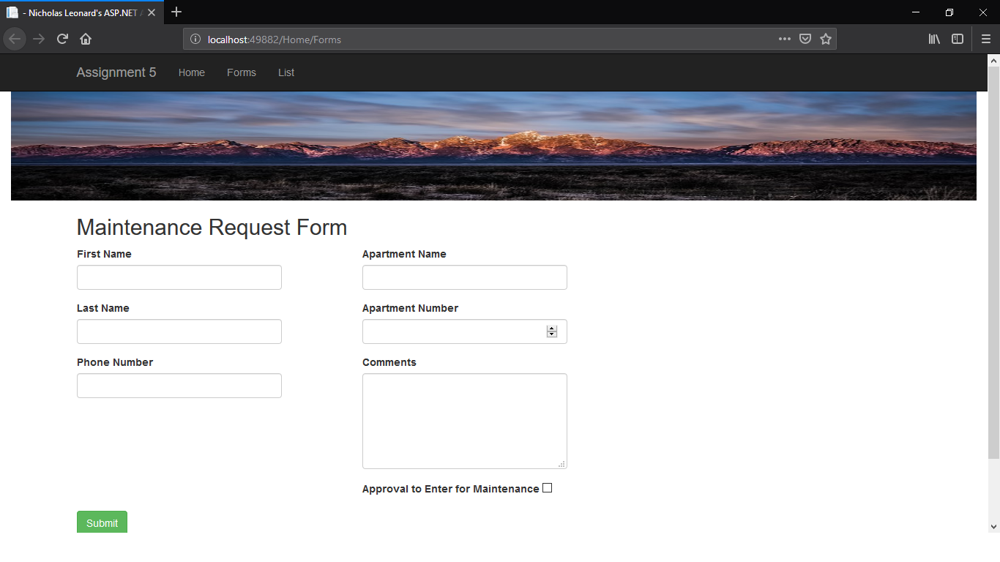
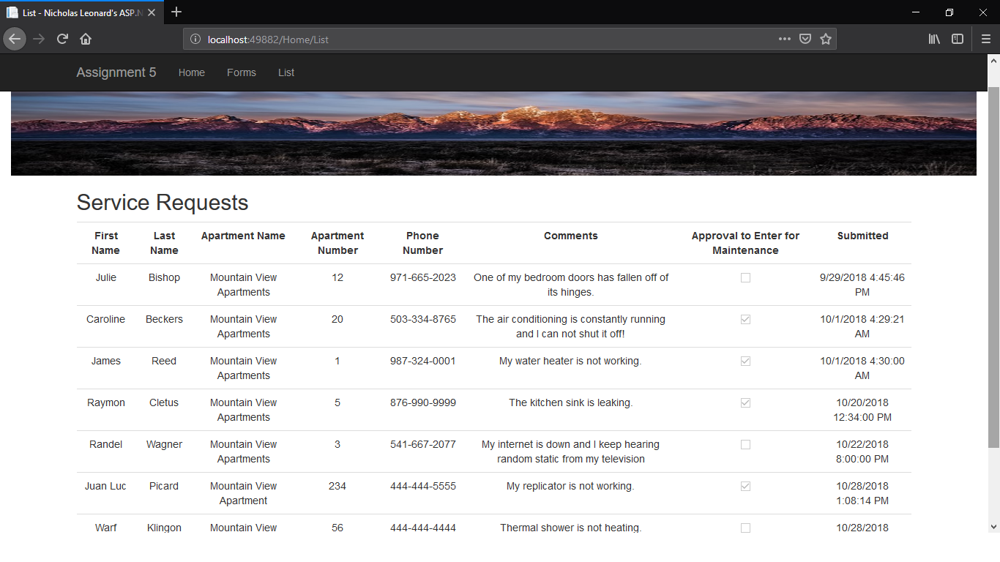

# Nicholas Leonard

## Homework 5

This assignment was about adding a database and a model to my previous use of the Model View Controller development layout. It also expanded on the types of views and action methods I can use with the Model View Controller development layout. This assignment was challenging. The amount of errors and bugs I had to deal with in order to get the application connected to the database was insane. However, it all worked out in the end and I was able to connect to the database and begin to develop an understanding of how MVC utilizes a database to make data persistent. It also started to help me understand how C# itself is used to connect to databases and the type of logic and procedures it requires. All in all, I had a lot of fun despite the initial headaches.

### Important Links

Here is the link to my GitHub repository, which houses all of the source code for this project and others. <br/>
[GitHub Repository](https://github.com/NicholasLeonard/NicholasLeonard.github.io)<br/>

Here is the link to a demo video of the application in action. <br/>
[Demo Video](https://www.youtube.com/watch?v=lUZODFTdpZA&t=3s)<br/>

This link will take you back to my main Portfolio page.<br/>
[Home](../../index.md)

### Step 1. Creating the new Project

I started by creating a new MVC project, similar to what I did with the last assignment. I then decided to take it one step at a time and start by just making a landing page for the application. I removed the link buttons on the landing page that the default project gave me. I also decided to add a picture that stretched across the top of my website beneath the navbar. I put the code for this in the main layout page for the entire website so that the picture would be on all of the pages in the website.

```html
 <div class="container-fluid">
    
 </div>
```


### Step 2. Creating the Model

The next thing I did was create the model class, which contained all of the fields that I wanted to keep track of in the database and put in the submission form. I also included `System.ComponentModel.DataAnnotations` so that I could use annotations for some built in validation. I used a regular expression to provide some formatting for the phone number field. As part of the assignment, when I displayed the contents of the database, the entries had to be sorted by submission time with the oldest at the top. As such, I included a `DateTime` submitted field that gets the current date and time when the form is submitted. This value is stored in the database but it is not displayed in the form. So it is a bit of server side calculation.

```csharp
/// <summary>
    /// CLass that defines data input for a tenants repair order for apartment complex.
    /// </summary>
    public class ServiceRequests
    {   //Used as the primary key in the database table
        [Key]
        public int ID { get; set; }

        //First name of tenant submitting repair order
        [Required, MaxLength(20), Display(Name = "First Name")]
        public string FirstName { get; set; }

        //Last name of tenant submitting repair order
        [Required, MaxLength(20), Display(Name = "Last Name")]
        public string LastName { get; set; }

        //Name of Apartment building where tenant lives
        [Required, MaxLength(40), Display(Name = "Apartment Name")]
        public string ApartmentName { get; set; }

        //Apartment number of tenant's residence
        [Required, Display(Name = "Apartment Number")]
        public int UnitNumber { get; set; }

        //Tenants phone number
        [Required, DataType(DataType.PhoneNumber), RegularExpression(@"^\d{3}-\d{3}-\d{4}$", ErrorMessage = "Please format to 999-999-9999"), Display(Name = "Phone Number")]
        public string Phone { get; set; }

        //Description of problem
        [Required, MaxLength(500), Display(Name = "Comments")]
        public string Comments { get; set; }

        //Wether or not maintenance can enter to resolve the problem
        [Display(Name = "Approval to Enter for Maintenance")]
        public bool EnterForMaintenance { get; set; }

        //Used by server to sort entries, it is auto generated
        public DateTime Submitted { get; set; } = DateTime.Now;
    }
```

### Step 3. Creating the Form page with a Strongly Typed View

Once I created my model, I designed the form page, which would house the form to submit to request a work order. Once I created the default view, I added a razor model using statement to make it a strongly typed view.

```csharp
@model SurveyResponse.Models.ServiceRequests
```

This allowed me to create the view by using razor helper functions that utilized lambda expressions to populate the form. I did the basic structuring myself with `<div>` elements, but the rest was created using razor helper functions and lambda expressions.

```html
<!--Form for submitting service requests-->
@using (Html.BeginForm("Forms", "Home", FormMethod.Post))
{
    @Html.AntiForgeryToken()

<div class="row">
    
    <div class="col-md-4">
        <div class="form-group">
            @Html.LabelFor(x => x.FirstName)
            @Html.EditorFor(x => x.FirstName, new { htmlAttributes = new { @class = "form-control" } })
        </div>
        <div class="form-group">
            @Html.LabelFor(x => x.LastName)
            @Html.EditorFor(x => x.LastName, new { htmlAttributes = new { @class = "form-control" } })
        </div>
        <div class="form-group">
            @Html.LabelFor(x => x.Phone)
            @Html.EditorFor(x => x.Phone, new { htmlAttributes = new { @class = "form-control"} })
        </div>
        @Html.ValidationSummary(false, "", new { @class="text-danger"})
    </div>
    <div class="col-md-6">
        <div class="form-group">
            @Html.LabelFor(x => x.ApartmentName)
            @Html.EditorFor(x => x.ApartmentName, new { htmlAttributes = new { @class = "form-control"} })
        </div>
        <div class="form-group">
            @Html.LabelFor(x => x.UnitNumber)
            @Html.EditorFor(x => x.UnitNumber, new { htmlAttributes = new { @class = "form-control" } })
        </div>
        <div class="form-group">
            @Html.LabelFor(x => x.Comments)
            @Html.TextAreaFor(x => x.Comments, new { @class = "form-control", cols = 10000, @rows = 5 })
        </div>
        <div class="form-group">
            @Html.LabelFor(x => x.EnterForMaintenance)
            @Html.CheckBoxFor(x => x.EnterForMaintenance)
        </div>
    </div>
</div>
   <div class="row">
       <div class="container-fluid">
          <button class="btn btn-success" type="submit">Submit</button>
       </div>
   </div>
}
```



### Step 4. Creating the Database Context Class and Up.sql and Down.sql

Once I finished making the form, I had to make the database context class so that my application could actually talk with the database. I put this class in a new folder called DAL or Data Access Layer. I also had to write two scripts, one for creating a table in the database and populating it called up.sql, and the other for deleting the table called down.sql. These I put in the App_Data folder, which contained the database file. I also had to seed my database with 5 entries. I put the code for this in the up.sql file.

```csharp
/// <summary>
/// Used to access ServiceRequest table in database
/// </summary>
    public class RequestContext : DbContext
    {
        public RequestContext() : base("name=ServiceRequests")
        {
            
        }
        /// <summary>
        /// Creates a connection between the MVC application and the database.
        /// </summary>
        public virtual DbSet<ServiceRequests> ServiceRequests { get; set; }
    }
```

```sql
-- Adds table to database and seeds it with 5 values
CREATE TABLE [dbo].[ServiceRequests]
(
	[Id] INT IDENTITY(0,1) NOT NULL,
	[FirstName] NVARCHAR(64) NOT NULL,
	[LastName] NVARCHAR(120) NOT NULL,
	[ApartmentName] NVARCHAR(40) NOT NULL,
	[UnitNumber] INT NOT NULL,
	[Phone] NVARCHAR(15) NOT NULL,
	[Comments] NVARCHAR(1000),
	[EnterForMaintenance] BIT NOT NULL,
	[Submitted] DateTime NOT NULL
	CONSTRAINT [PK_dbo.ServiceRequests] PRIMARY KEY CLUSTERED([ID] ASC)
);

INSERT INTO [dbo].[ServiceRequests] (FirstName, LastName, ApartmentName, UnitNumber, Phone, Comments, EnterForMaintenance, Submitted) VALUES
('James', 'Reed', 'Mountain View Apartments', '1', '987-324-0001', 'My water heater is not working.', '1', '2018-10-1 04:30:00'),
('Caroline', 'Beckers', 'Mountain View Apartments', '20', '503-334-8765', 'The air conditioning is constantly running and I can not shut it off!', '1', '2018-10-1 4:29:21'),
('Raymon', 'Cletus', 'Mountain View Apartments', '5', '876-990-9999', 'The kitchen sink is leaking.', '1', '2018-10-20 12:34:00'),
('Julie', 'Bishop', 'Mountain View Apartments', '12', '971-665-2023', 'One of my bedroom doors has fallen off of its hinges.', '0', '2018-09-29 16:45:46'),
('Randel', 'Wagner', 'Mountain View Apartments', '3', '541-667-2077', 'My internet is down and I keep hearing random static from my television', '0', '2018-10-22 20:00:00')
GO
```

```sql
-- Remove Table from ServiceRequests Database
DROP TABLE [dbo].[ServiceRequests];
```

### Step 5. Making the List page and Writing the Controller for the Application

After I was able to connect to the database and populated it, I had to make the page that would display the results from the database. This was done by passing the view a list and making the view an `IEnumerable` type so that it could be iterated over and results could be displayed.

```html
@model IEnumerable<SurveyResponse.Models.ServiceRequests>

@{
    ViewBag.Title = "List";
}

<h2>Service Requests</h2>
<!--A table for Displaying the requests from the database-->
<table class="table table-responsive text-center">
    <tr>
        <th class="text-center">
            @Html.DisplayNameFor(model => model.FirstName)
        </th>
        <th class="text-center">
            @Html.DisplayNameFor(model => model.LastName)
        </th>
        <th class="text-center">
            @Html.DisplayNameFor(model => model.ApartmentName)
        </th>
        <th class="text-center">
            @Html.DisplayNameFor(model => model.UnitNumber)
        </th>
        <th class="text-center">
            @Html.DisplayNameFor(model => model.Phone)
        </th>
        <th class="text-center">
            @Html.DisplayNameFor(model => model.Comments)
        </th>
        <th class="text-center">
            @Html.DisplayNameFor(model => model.EnterForMaintenance)
        </th>
        <th class="text-center">
            @Html.DisplayNameFor(model => model.Submitted)
        </th>
    </tr>
    
    @foreach (var item in Model)
    {<!--Loop iterates through and displays all items from the table-->
        <tr>
            <td>
                @Html.DisplayFor(modelItem => item.FirstName)
            </td>
            <td>
                @Html.DisplayFor(modelItem => item.LastName)
            </td>
            <td>
                @Html.DisplayFor(modelItem => item.ApartmentName)
            </td>
            <td>
                @Html.DisplayFor(modelItem => item.UnitNumber)
            </td>
            <td>
                @Html.DisplayFor(modelItem => item.Phone)
            </td>
            <td>
                @Html.DisplayFor(modelItem => item.Comments)
            </td>
            <td>
                @Html.DisplayFor(modelItem => item.EnterForMaintenance)
            </td>
            <td>
                @Html.DisplayFor(modelItem => item.Submitted)
            </td>
        </tr>
    }
</table>
```

This allowed me to make the table, but the results needed to be sorted by submission time. To do this, I passed the view an already sorted list from the controller. I used C# dynamic variables to sort the list. This method allowed me to use the `Linq` library methods to do all of the calculations and conversions before passing back to the view. That way I was able to use the server to do all the computation and just use the view for displaying the result.

```csharp
...
/// <summary>
        /// Action method for displaying the degault list page
        /// </summary>
        /// <returns></returns>
        [HttpGet]
        public ActionResult List()
        {//initializes list variable with table from the database, intializes orderedlist variable with sorted list variable
            var list = db.ServiceRequests.ToList();
            var orderedlist = list.OrderBy(item => item.Submitted);
            //returns sorted list rather than by table order
            return View(orderedlist);
        }
...
```

After that was done, I had to write the action methods to display the other views. So I wrote action methods that would display the default home page, the default form page, and the list page. After submitting a service request, I wanted the user to be able to see their request along with the other requests that are ahead of them. So I used a `RedirectToAction()` action method that redirected the user to the list page, which automatically updated the table with their request when the page is rendered.

```csharp
...
/// <summary>
        /// Displays main landing page for Mountain View Apartments
        /// </summary>
        /// <returns></returns>
        public ActionResult Index()
        {
            return View();
        }

        /// <summary>
        ///Action method displays default form page to be filled and submitted to the database.
        /// </summary>
        /// <returns></returns>
        [HttpGet]
        public ActionResult Forms()
        {
            return View();
        }

        /// <summary>
        /// Action method for submitting to the database
        /// </summary>
        /// <param name="serviceRequest"></param>
        /// <returns></returns>
        [HttpPost]
        [ValidateAntiForgeryToken]
        public ActionResult Forms([Bind(Include="ID,FirstName,LastName,ApartmentName,UnitNumber,Phone,Comments,EnterForMaintenance,Submitted")] ServiceRequests serviceRequest)
        {//first confirms that form submission is valid
            if (ModelState.IsValid)
            {//stages additions to database. Next line commits the changes to the database
                db.ServiceRequests.Add(serviceRequest);
                db.SaveChanges();
                //Redirects to the list page that displays the updated table in the database
                return RedirectToAction("List");
            }
            //if the submit is invalid, it returns the default form view
            return View(serviceRequest);
        }
...
```

At the bottom of the controller, I put a statement to release the controllers access to the database so that memory can be freed up.

```csharp
...
/// <summary>
        /// Garbage collection method for disposing of database access when the controller has finished executing
        /// </summary>
        /// <param name="disposing"></param>
        protected override void Dispose(bool disposing)
        {
            if (disposing)
            {
                db.Dispose();
            }
            base.Dispose(disposing);
        }
```

Here is a screenshot of the list page.



And that is how I made a second MVC project, this time using a database. Thanks for reading.
