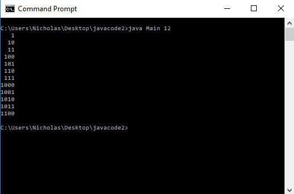

# Nicholas Leonard
<br/>
## Homework 3

For this assignment, I had to translate a simple Java application into C#. This process turned out to be easier then I had expected. I have very little experience with Java and no experience with C#. However, it was straight forward enough for me to understand and it was very similar to Java. Once more, it was a new and fun experience for me to work with and experiment with C# so that I could develop my understanding of it.

### Important Links
Here is the link to my github repository that holds all of the source files for this assignment and others.<br/>
[Github Repository](https://github.com/NicholasLeonard/NicholasLeonard.github.io)<br/>

Here is the link to take you back to the home page of my Portfolio.<br/>
[Home](../index.md)

### Step 1. Setting up my IDE (Integrated Development Environment)

This assignment presented the first oppertunity for me to use an IDE for the class. The IDE that I used was Visual Studio 2017 Community addition. I also went through and installed several extensions that allow Visual Studio 2017 to work with C# and the .NET Framework.

### Step 2. Run the Java Program

Before I could start translating the Java code, I had to run the program and see what it actually does. So, using a Windows Command Prompt, I navigated to the folder containing the Java files and ran the program with an input of 12.

<br/>

I then tried running it without giving it an argument to test the program and see what would happen. It returned a string to the console with an example of how to properly run the program.


To further test the program, I ran it with a string instead of a number and I tried running it with a negative number. The program printed a string to the console saying that it did not recognize the input number, but it seemed to have no response for the negative number except to crash the program.


### Step 3. Translating the program into C#.

Before doing this homework assignment, I had worked with very little Java and I had never touched C#. However, I was able to effectively work out the translation from Java to C# and I actually really like C#. I like its simplicity and format as well as the strength of its type safety. 

I started with the Node class. Because C# contains a lot of similarities to Java, the only real difference between the Java file and the C# file were the nameing conventions, such as capitalization of public variables and methods, the format of the XML comments, and the use of a namespace in C#. I actually started by just translating the code and then came back through later and added the XML comments for the C# code.

```java
/** Singly linked node class. (Java)*/

public class Node<T>
{
	public T data;
	public Node<T> next;
	
	public Node( T data, Node<T> next )
	{
		this.data = data;
		this.next = next;
	}
}
```
```C#
namespace Translation
{
    /// <summary>
    /// Node class for a singly linked list.
    /// </summary>
    /// <typeparam name="T"></typeparam>
    public class Node<T>
    {
    
        public T Data;
        public Node<T> Next;
        /// <summary>
        /// Constructor for assigning data value and pointer for linked list.
        /// </summary>
        /// <param name="Data"></param>
        /// <param name="Next"></param>
        public Node( T Data, Node<T> Next )
        {
            this.Data = Data;
            this.Next = Next;
        }
    }
}
```