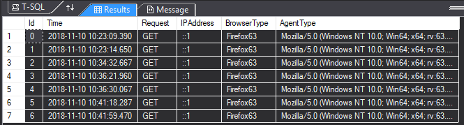

# Nicholas Leonard
<br/>
## Homework 7
This assignment was all about asynchronous page manipulation. I was required to use javascript, jquery, and ajax to dynamically and asynchronously update my web page without reloading the entire page. I really enjoyed this assignment. It was fairly simple and straight forward and it also provided the opportunity for me to use an external API for the first time.

### Important Links
Here is the link to my github repository, which houses all of the source code for this project and others. <br/>
[Github Repository](https://github.com/NicholasLeonard/NicholasLeonard.github.io)<br/>

This link will take you back to my main Portfolio page.<br/>
[Home](../index.md)

### Step 1 Setting up Communication with the Giphy API
For this assignment, I had to send regular requests to the external Giphy API to display giffs on my web page in place of some words. Thus, I had to go to the Giphy website and register as a developer so that I could get an API key to make regular requests from the site. Once I was given my key, I had to make a new config file that contained the key and keep it outside of my repository so that nobody could see it. I also added the location of my file to the App Settings section of my `Web.config` file.

```csharp
  <appSettings file="..\..\..\AppSettingsSecrets.config">
    <add key="webpages:Version" value="3.0.0.0" />
    <add key="webpages:Enabled" value="false" />
    <add key="ClientValidationEnabled" value="true" />
    <add key="UnobtrusiveJavaScriptEnabled" value="true" />
  </appSettings>
```

### Step 2 Coding the Simple Page with a Text Box
The purpose of the main page was to provide a text box for the user to type into that then displays the input beneath it. The cool thing is that for "interesting" words, the page sends an ajax request to the controller for a giff of the "interesting" word. So to start, I made a simple page with a text box that spanned the whole length of the page for the user to type into and added a section beneath it for displaying the results. I also added a button for clearing the page and the current user input so that the user could begin again. I gave the text box, the button, and the results section an id so that I could reference it in my javascript and dynamically affect the page.

```html
<!--Text box for user input-->
<div class="container text-center">
    <h2>Giphy Stuff</h2>
    <div class="form-group">
        <input class="form-control" type="text" id="textbox" placeholder="Type Here"/>
    </div>
    <div>
        <button class="btn btn-danger" id="clear" align="left">Clear</button>
    </div>
</div>

<!--displays content from textbox-->
<div class="container">
    <p id="dynamic"></p>
</div>
```
I also had to add my javascript file to the page by having it render a script tag with my file by rendering a section. So I modified the basic page and the main layout page to render these sections.

```html
<!--From main page-->
@section mySection{
    <script src="~/Scripts/Asynch.js"></script>
    }

<!--From layout page-->
@RenderSection("mySection", required: true)
```

### Step 3 The Javascript
Once I had made the page, I had to add some javascript to make it dynamic. So I started by using jquery to access the text box and then waited for a `keydown` event on the box. After the event fired, I had the event wait for the space bar to be pressed and then I got the input from the text box. I then split the input into an array of strings that split on a `" "` space so that each word in the input would be its own string. I then took the last word in the array and compared it to a list of nouns and verbs that I found on git hub (https://gist.github.com/ijmacdowell/8325491). If the word matched, I constructed an ajax request and sent it off to the controller to be sent to the Giphy API.

```javascript
$("#textbox").keydown(function (event) {
    var keyName = event.key;
    
    //executes parsing logic to compare the last word typed with a list of words and sends it off to the Giphy api
    if (keyName === " ") {
        var input = $("#textbox").val().toString();
        var inputSub = input.split(" ");
        var last = inputSub.pop();
        var nouns = nounWordComparison();
        var verbs = verbWordComparison();

        //checks for a match
        if (nouns.indexOf(last) != -1 || verbs.indexOf(last) != -1) {
            var source = "/Api/Giph/" + last

            //ajax request to get a giph for displaying on the screen
            $.ajax({
                method: "GET",
                dataType: "json",
                url: source,
                success: displayResult,
                error: ajaxError
            });
        } else {
            //adds words to the dynamic paragraph section
            $("#dynamic").append(last + " ");
        }
    }
});
```
I also had a function that was listening to the clear button and that cleared the whole page if it was pressed so that the user could begin again.

```javascript
$("#clear").click(function () {
    $("#dynamic").empty();
    $("#textbox").val("");
});
```

Once the results were sent back to the page from the controller, I had to functions to handle what was sent back. The first displays the giff and the second displays an error message if the results were unusable. The `displayResult` function adds an `<iframe>` element to the dynamic section in order to display the result.

```javascript
//used to display the results of the Giphy api search
function displayResult(preview) {
    console.log(preview);
    var test = JSON.parse(preview);
    //constructs an iframe element for displaying a giph
    $("#dynamic").append(' <iframe src="' + test.embed_url + '" width="100" height="100" align="middle" frameborder="0"></iframe> ');
}
```
The error message function just clears the dynamic section and adds an error message to it.

```javascript
function ajaxError() {
    $("#dynamic").empty();
    $("#dynamic").append("FATAL GIPHY ERROR!!!!!!");
}
```

### Step 4 The Controller and the Giphy API
After all of the javascript was done, I had to work on the logic for the controller so it could send a request to the external Giphy API for a giff. I started by making a new controller that would specifically handle constructing the request for the API. Once I made the controller, I had to go into my `RouteConfig.cs` file and add a new custom route for the controller so that the ajax requests from the page would go to the API specific controller rather than just the Main controller.

```csharp
public class RouteConfig
    {
        public static void RegisterRoutes(RouteCollection routes)
        {
            routes.IgnoreRoute("{resource}.axd/{*pathInfo}");

            routes.MapRoute(
                name: "ApiRequest",
                url: "{controller}/{action}/{word}",
                defaults: new { controller = "Api", action = "Translate"}
                );

            routes.MapRoute(
                name: "Default",
                url: "{controller}/{action}/{id}",
                defaults: new { controller = "Main", action = "Index", id = UrlParameter.Optional }
            );
        }
    }
}
```
I then had to write the method that would handle the ajax request from the page. I did this using a `JsonResult` method that took the "interesting" word as a parameter to construct the API request. To send a request to the giphy API, I had to construct a url that contained the path for the API, my API key, and the "interesting" word that was typed so that it could send back a giff for the word. I started by accessing my key through in the secret file by going through `ConfigurationManager` and accessing the value through key value pair. Once I had the key, I made a new string with the url path for the API, my key, and the word to search. I then had to open a connection with the API by using the `WebRequest` class to create a connection with the API. I also had to create a connection stream with the server and a stream reader so that I could get the response from the server. The response from the API server came back as a json object, so I had to parse it and pull out the data I wanted, which I then sent back to the page.

```csharp
/// <summary>
        /// Handles ajax request for content from giphy api
        /// </summary>
        /// <param name="word"></param>
        /// <returns></returns>
        [HttpGet]
        public JsonResult Giph(string word)
        {
            //constructs the uri for requesting from the giphy api
            string key = ConfigurationManager.AppSettings["GiphyAPIKey"];
            string URL = "https://api.giphy.com/v1/stickers/translate?api_key=" + key + "&s=" + word;

            //creates the connection between the controller and the giphy api
            WebRequest request = HttpWebRequest.Create(URL);
            HttpWebResponse response = (HttpWebResponse)request.GetResponse();
            
            //creates a new stream to the giphy api and a new streamreader for that stream
            Stream dataStream = response.GetResponseStream();
            StreamReader reader = new StreamReader(dataStream);

            //reads the response from the Api
            string ApiResponse = reader.ReadToEnd();
            //parses the json object to get the necessary data and converts it to a string for entry in the next parse
            string data = JObject.Parse(ApiResponse)["data"].ToString();
            
            //Debug.WriteLine(data);
            //initializes a new record for entry into the database
            Search search = new Search
            {
                Time = DateTime.Now,
                Request = Request.HttpMethod,
                IPAddress = Request.UserHostAddress,
                BrowserType = Request.Browser.Type,
                AgentType = Request.UserAgent
            };

            //adds record to the database
            db.Searches.Add(search);
            db.SaveChanges();

            //closes connections to Giphy Api
            reader.Close();
            dataStream.Close();
            response.Close();

            return Json(data, JsonRequestBehavior.AllowGet);
        }
```

### Step 4 A Database
As part of the assignment, I also had to keep a log of the requests that were sent to the controller and some of the information about the client. So, I wrote a simple `up.sql` file that created a database with one table in it where I kept my records. I recorded the client ip address, the browser type, the agent type, the time of the request, and the type of request. After I made the database, I used Entity Framework to make a model and a context class from the existing database so that I could record my logs.

```csharp
CREATE TABLE [dbo].[Searches]
(
	[Id] INT IDENTITY(0,1) NOT NULL,
	[Time] DateTime NOT NULL,
	[Request] NVARCHAR(10) NOT NULL,
	[IPAddress] NVARCHAR(20) NOT NULL,
	[BrowserType] NVARCHAR(20) NOT NULL,
	[AgentType] NVARCHAR(500) NOT NULL
	CONSTRAINT [PK_dbo.Searches] PRIMARY KEY CLUSTERED([ID] ASC)
);
```
```csharp
/// <summary>
    /// Creates a connection with the logging database
    /// </summary>
    public partial class SearchContext : DbContext
    {
        public SearchContext()
            : base("name=SearchContext")
        {
        }

        public virtual DbSet<Search> Searches { get; set; }

        protected override void OnModelCreating(DbModelBuilder modelBuilder)
        {
        }
    }
```
```csharp
/// <summary>
    /// Model for logging giph requests in the database
    /// </summary>
    public partial class Search
    {
        public int Id { get; set; }

        public DateTime Time { get; set; }

        [Required]
        [StringLength(10)]
        public string Request { get; set; }

        [Required]
        [StringLength(20)]
        public string IPAddress { get; set; }

        [Required]
        [StringLength(20)]
        public string BrowserType { get; set; }

        [Required]
        [StringLength(500)]
        public string AgentType { get; set; }
    }
```
I also have two different pictures showing the different entries in the database.




Because I had to log my API requests, I had to add the recording logic to the method handling the requests. So, when a new search is sent to the method, it initializes a new `Search` class with the time of the request, the ip address, the browser type, the user agent, and the request type and then adds it to the database and saves the changes.

```csharp
//initializes a new record for entry into the database
            Search search = new Search
            {
                Time = DateTime.Now,
                Request = Request.HttpMethod,
                IPAddress = Request.UserHostAddress,
                BrowserType = Request.Browser.Type,
                AgentType = Request.UserAgent
            };

            //adds record to the database
            db.Searches.Add(search);
            db.SaveChanges();
```
I also added the disposing method at the end of the controller to properly dispose of the connection to the database when the controller finishes execution.

```csharp
/// <summary>
        /// Disposes of connection to database
        /// </summary>
        /// <param name="disposing"></param>
        protected override void Dispose(bool disposing)
        {
            if (disposing)
            {
                db.Dispose();
            }
            base.Dispose(disposing);
        }
```
And that is how I made the asynchronous web page. Thanks for reading.