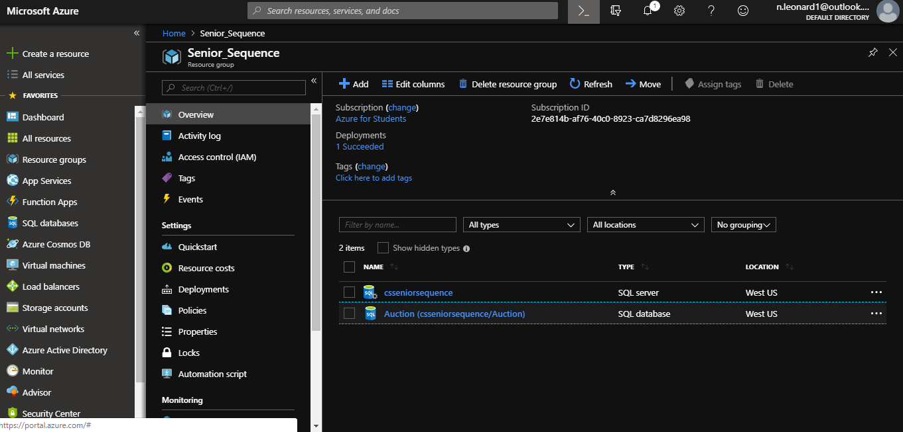

# Nicholas Leonard
 
## Assignment 9
This assignment, simply involved taking the website that we developed for homework 8 and deploying it on azure.
 
### Important Links
Here is the link to my github repository. 
[Github Repository](https://github.com/NicholasLeonard/NicholasLeonard.github.io) 

This link will take you back to my main Portfolio page. 
[Home](../index.md) 

Here is the link to the deployed azure site. 
[Reginald's Auction House](https://hw9.azurewebsites.net)

### The Process
The first thing I had to do was make an account on azure and create a resource group to house all of the azure stuff. 

 
I then had to make a SQL Server and SQL Database and add a firewall rule to allow my machine to access the database. 

 

 
I then connected to the azure database in visual studio and ran the up script to create tables and seed the database. 

 
I then made a Web App on azure and deployed it into the resource group and then published the site from visual studio into the deployed Web App. 

 

