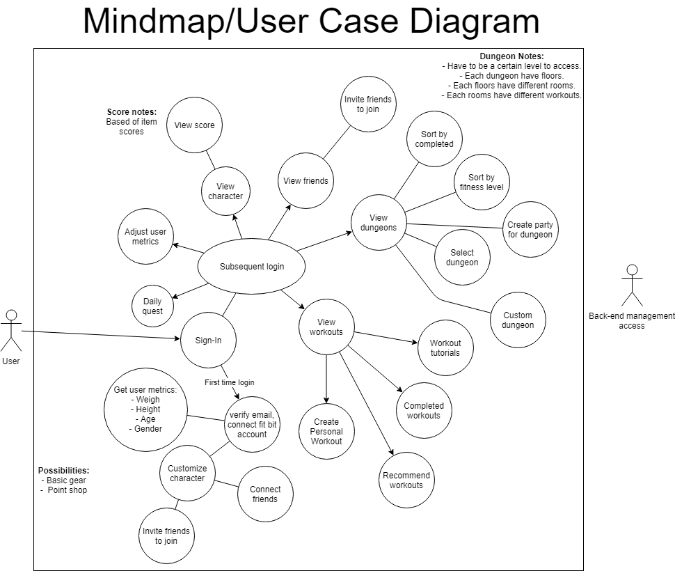
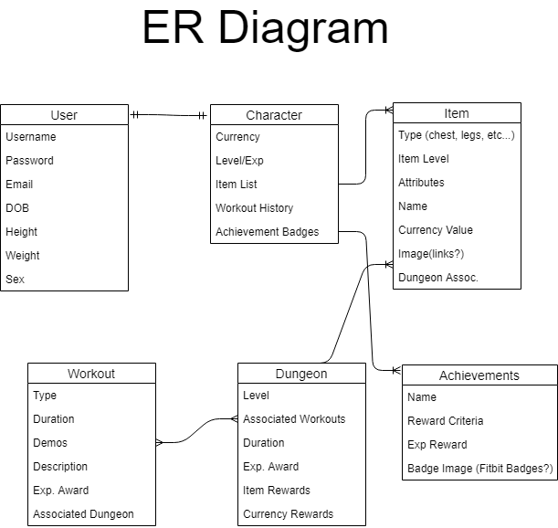
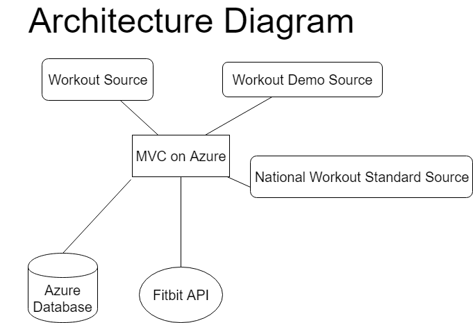

2018-19 Toaster Code Team Project
=====================================

## Vision Statement

For people who want to get in shape or work out, the rpg-lite workout is a workout planning platform that integrates rpg elements into a workout plan. The webapp gives the user a workout plan customized and curatyed by them while providing a gamified interface and spin to all fitness activities that remsembles a role playing game. Unlike other gamified applications, our product will both focus only on a fitness expierence and provide the user with state reccommend workouts in a fun, social format.

## Summary of Our Approach to Software Development

Our approach to software development involves the Disciplined Agile Delivery method intermixed with key elements of other approaches. Namely SCRUM. We generally use the MVC 5 software architecture and outside database support. We believe in the quality of work produced by a small team of collaborating, respectful, and singly located development professionals.

## Initial Requirements Elaboration and Elicitation

### Questions

1. Are the workout demos/videos stored in our database or is it a link to the video off site.
A. Mostlikly off site. We will see when it comes to it.

2. Is there an API that has all of the workout video details already that we can just pull from.
A. Need to look into this.
3. Are users allowed to use a psudeynom or are we storing actual names?
A. psudeynom, not storing names, we are storing email address.
    
## List of Needs and Features
1. Need to be able to see what workouts are recommended for them and safe for them based upon their statistics.
2. We need to have demos/descriptions of the workouts for users
3. User accounts.
4. Display individual user workout statistics.
5. Character customization options.
6. A nice looking landing page with links/widgets to other pages.
7. The ability to invite friends to the site.
8. Adding workout goals. User selected workout goals.
9. Daily quests/workout goals. i.e. 5000 steps a day etc.
    -based on metrics, goals, possibly have tiers of quests
10. All user highscore page.
11. Set user metrics.
12. Calculate workouts appropriate for users metrics.
13. Shop to buy gear with coins earned from the dungeons.
14. Achievement page.
15. A page that lists all of the available dungeons.
16. Character view page.
17. Algorithm that proposes workouts/dungeons based on national standareds and user BMI/Metrics.
18. Integration with fitbit api.
19. The ability for users to import fitbit metrics and data.

## Initial Modeling

### Other Modeling

## Identify Non-Functional Requirements

1. Sources for nationally recommended workout schedules and goals.
2. Sources for workout demos, videos, tutorials.
3. Fitbit.
4. Sources for item graphics and possibly stats.
5. Password encryption

## Identify Functional Requirements (User Stories)

E: Epic  
F: Feature  
U: User Story  
T: Task  

1. [E] Allow users to access and complete dungeons.
    1. [F] Users are able to view dungeons and there requirements
    2. [F] Dungeons are available specifically to user level and fitness ability
2. [E] Allow users to interact with their charcter.
3. [F] Allow users to log in and view the site.
    1. [U] As a new user, I want to create an account for the website.
    2. [U] As a new user, I want to customize my character.
    3. [U] As a new user, I want to connect my fitbit account.
    4. [U] As a new user, I want to enter my metrics.
    5. [U] As a new user, I want to receive an email verifying my registration with the site.
    6. [U] As a loged in user, I want to adjust my metrics.
    7. [U] As a loged in user, I want to view workouts
4. [E] Allow users to start and complete workouts.
    1. [F] Users are able to view workout tutorials.
        1. [U] As a loged in user, I want to view workout tutorials for available workouts.
        2. [U] As a loged in user, I want to sort the workout tutorials for the kind of workout I want to do (i.e. upperbody, legs, core...)
    2. [F] Users are able to view workouts.
        1. [U] As a loged in user, I want to view the list of currently available workouts.
        2. [U] As a loged in user, I want to view the details for a specific workout.
        3. [U] As a loged in user, I want to see what rewards the workout gives.
    3. [F] Users are able to select and start a workout.
        1. [U] As a loged in user, I want to select a workout so I can do it.
        2. [U] As a loged in user, I want to receive my rewards when I finish the workout.
        3. [U] As a loged in user, I want my stats to be tracked by the website so that I can level up my character and earn loot.
5. [E] Users are able to interact with friends.

## Initial Architecture Envisioning

## Identification of Risks

### Board up the windows(100%)

#### Group members are absent from meetings and work

    -Risk Level: Low
    -Reason: For some reason or another, a member of the group is missing from an activity
    -Plan of Action: We need to work without that member for the particular part of the project
    -Prevention: Members need to be open about their availablity and communicate on how to meet, additionaly

#### Visual Studio causes an issue

    -Risk level: Medium
    -Reason: Due to the wonderful software that is visual studio we could see strange issues caused by the software down the line
    -Plan of Action: We need to be aware of issues as they arise to spot them quickly and adjust for them
    -Prevention: Be aware of what visual studio integration you use and how they work, pray visual studio is not dumb

### Likely(75%)

#### Workout Demo resources are unavaible

    -Risk Level: Medium
    -Reason: We need or want to add and exercise or routine to the project but the video or images expalining it are unusable or nonexistant
    -Plan of Action: We will either use infographics for the missing info or make the images/videos ourselves
    -Prevention: Look up our exercises before implementing in our code

#### We will overestimate the amout of work required for a given task

    -Risk level: Low
    -Reason: As our group is inexpierenced and learning many new things, we will need to spend time learning how to gauge time rquirements, we will not always get this right 
    -Plan of Action: We will have to move tasks and userstories as time rquirements are refined
    -Prevention: In time we will gain more expierence to be able to accurately guage time restraints

### Might Happen(50%)

#### The fitbit API has an update, causing a part of the project to break

    -Risk Level: Medium 
    -Reason: Fitbit has many updates, it possible one of these could affect our features 
    -Plan of action: Keep up with updates via the fitbit release notes and see as changes play out
    -Prevention: Design our interactions with the fitbit to be with abstraction and encapsulation to just get to data we need 

### There is a chance(25%)

#### The fitbit API encounters a issue, making it incompatible with the current project

    -Risk Level: High
    -Reason: Either a change in our infrastructure or the API casues our current use of the files to be unsupported
    -Plan of Action: Find a new API to integrate into the project and remove all traces of the old one IF unable to fix, otherwise try to change the integration to match the new API changes
    -Prevention: Know in and out how the API works and how it will interact with features in the future

#### A piece of refrence material we use for an exercise is not legally usuable

    -Risk Level: Low
    -Reason: Either due misuse or lack of research, we may accidently infringe on copyrighted material
    -Plan of Action: Remove the given material as soon as possible
    -Prevention: Be sure to understand what you are using before you use it when it comes to materials

### Not likely(10% or less)

#### We need to scrap the project due to failure at MVC intialization

    -Risk Level: High
    -Reason: Some part of the architexture is messed up at the start of the project and we need to scrap all work to fix it
    -Plan of Action: Properly save all salvalagable parts of the project and move them into new, working eviroment, make sure to go through these imported files for errors that switch might cause
    -Prevention: Make sure we have a strong intialization of the project and know the tools we need to use and how they interact

#### The internet explodes

    -Risk Level: Demon
    -Reason: Society has collapsed
    -Plan of Action: Try to recreate the system using the big five tech companies
    -Prevention: none

## Timeline and Release Plan

### Sprint 1

February 11, 2019 - February 22, 2019
First Development release

### Sprint 2

February 25, 2019 - March 8, 2019
Second Development release

### Sprint 3

April 1, 2019 - April 12, 2019
Third Development release

### Sprint 4

April 15, 2019 - April 26, 2019
Fourth Development release
Unit testing TBA

### Sprint 5

April 29,2019 - May 10, 2019
Fifth Development release
Unit testing TBA

### Sprint 6

May 13, 2019 - May 24, 2019
v1.0 Deployment Release
Unit Testing TBA