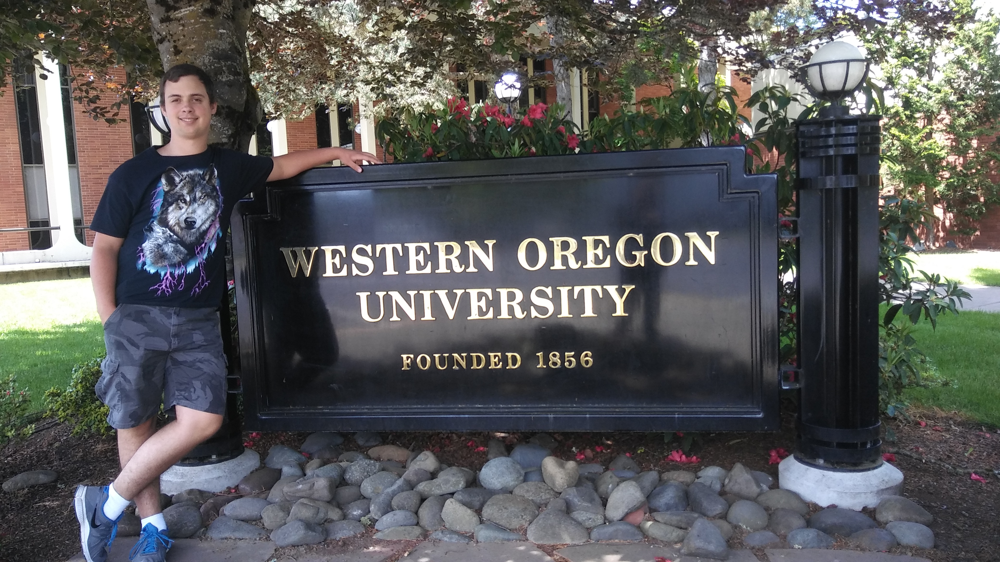

# Nicholas Leonard

This is a Portfolio that contains all of the work that I have done for CS 460, which is the first course in the Senior sequence at Western Oregon University.

## About Me

I am a Senior at Western Oregon University studying Computer Science. I will be graduating in June 2019 and am looking forward to a long and fulfilling career as a software engineer. I enjoy camping, hiking, and fishing. I like to play video games as well as watch movies and I really enjoy having LAN parties with friends. Someday I would like to do some traveling. I would love to travel from the west coast to the east coast and do some traveling over seas.

## Code Repository

Here is the link to my github repository which houses all of the source code that I used for all of these projects.
[Github Repository](https://github.com/NicholasLeonard/NicholasLeonard.github.io)

## Homework CS 460 Software Engineering I

Here are all the links to the blogs and demos of the work I did throughout the term.

1. [Homework 1](CS_460/HW1/h1index.md) CSS, HTML, Git, and Bootstrap
2. [Homework 2](CS_460/HW2/h2index.md) Javascript and JQuery
3. [Homework 3](CS_460/HW3/h3index.md) C# and Visual Studio
4. [Homework 4](CS_460/HW4/h4index.md) MVC Application! Understanding GET and POST!
5. [Homework 5](CS_460/HW5/h5index.md) MVC Application with Database containing one table
6. [Homework 6](CS_460/HW6/h6index.md) MVC Application with Big Database
7. [Homework 7](CS_460/HW7/h7index.md) MVC Application with Dynamic AJAX Updates
8. [Homework 8](CS_460/HW8/h8index.md) MVC Application with multi-table Relational database we wrote
9. [Homework 9](CS_460/HW9/h9index.md) Deployed MVC Application on Azure
